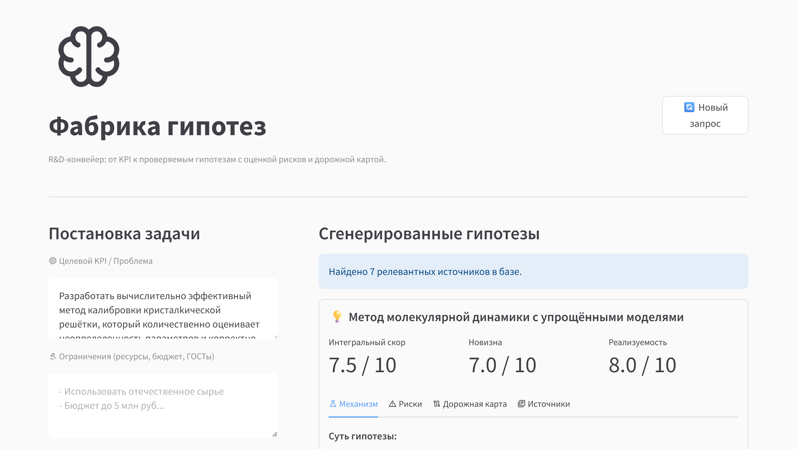

# Hypothesis Factory

Система автоматизированной генерации и валидации R&D-гипотез. Инструмент формирует физико-химические и технологические гипотезы на основе заданных целевых KPI и ограничений, используя внутреннюю базу знаний предприятия и алгоритмы больших языковых моделей (YandexGPT). 

Решение разработано в рамках Nornickel AI Hackathon (Июль 2026).


## Ключевые возможности

* Парсинг PDF-документов с сохранением структуры данных.
* Генерация гипотез с использованием RAG-конвейера на базе внутренней документации.
* Автоматическая валидация, расчет метрик и оценка рисков с помощью агента-критика.
* Интерактивный веб-интерфейс для управления R&D процессом.

## Архитектура и стек технологий

* **Frontend:** Streamlit.
* **Backend:** FastAPI, Uvicorn, Pydantic.
* **ML / AI:** YandexGPT, Instructor (структурирование вывода LLM), OpenAI Python Client (маршрутизация API).
* **RAG & Извлечение данных:** Docling, ChromaDB, Sentence-Transformers.
* **Инфраструктура ядра:** PyTorch 2.6.0, Torchvision 0.20.1 (CUDA 12.4).
* **Инструментарий:** Пакетный менеджер `uv`, `ruff` (линтинг/форматирование), `pyright` (статическая типизация).

## Структура репозитория

```text
.
├── backend/
│   └── main.py                 # API-сервер (FastAPI)
├── frontend/
│   ├── api_client.py           # HTTP-клиент для взаимодействия с backend
│   └── app.py                  # UI-интерфейс (Streamlit)
├── src/
│   └── hypothesis_factory/
│       ├── __init__.py
│       ├── base.py             # Pydantic-схемы (BusinessRequest, DocumentChunk и др.)
│       ├── critic.py           # Агент-критик для валидации и оценки рисков (YandexGPT)
│       ├── generator.py        # Агент-генератор гипотез (YandexGPT)
│       ├── ingestion_gpu.py    # Модуль GPU-парсинга PDF документов через Docling
│       ├── pipeline.py         # Основной оркестратор (Self-correction loop)
│       └── retrieval.py        # Модуль взаимодействия с векторной БД
├── data/
├── notebooks/
├── tests/
│   ├── conftest.py
│   ├── test_critic_api.py      # Интеграционные тесты критика
│   └── ...                     # Юнит-тесты модулей
├── pyproject.toml              # Метаданные, зависимости, конфигурация ruff/pyright
├── uv.lock                     # Lock-файл транзитивных зависимостей
└── README.md
```

## Требования и установка

**Системные требования:**
* Python >= 3.10
* Пакетный менеджер `uv`
* **Аппаратное обеспечение:** Обязательно наличие CUDA-совместимого GPU (строго от 8 ГБ VRAM). Выполнение на CPU не предусмотрено архитектурой обработки документов и векторной базы.

**1. Клонирование и базовая установка:**
```bash
git clone https://github.com/artyomsavov/hypothesis-factory
cd hypothesis-factory
uv pip install -e .
```

**2. Установка GPU-зависимостей (PyTorch):**
Конвейер векторизации и парсинга требует сборки PyTorch с аппаратным ускорением. Пример для систем с CUDA 12.4:
```bash
uv pip install torch==2.6.0+cu124 torchvision==0.20.1+cu124 --extra-index-url [https://download.pytorch.org/whl/cu124](https://download.pytorch.org/whl/cu124)
```
*(При развертывании убедитесь, что версия сборки `+cuXXX` соответствует версии CUDA на хост-машине).*

**3. Конфигурация окружения:**
Создайте файл `.env` в корневой директории и укажите учетные данные Yandex Cloud:
```env
YANDEX_API_KEY=ваш_api_ключ
YANDEX_FOLDER_ID=ваш_id_каталога
```

## Запуск приложения

Приложение состоит из двух независимых сервисов. Для удобства запуска в фоновом режиме (с отвязкой от терминала) предусмотрены bash-скрипты.

**Запуск сервисов:**
```bash
chmod +x start.sh
./start.sh
```
* API сервер (FastAPI) будет доступен на порту `8000`.
* Пользовательский интерфейс (Streamlit) будет доступен на порту `8501`.

**Остановка сервисов:**
```bash
chmod +x stop.sh
./stop.sh
```

**Внешний вид сервиса:**


